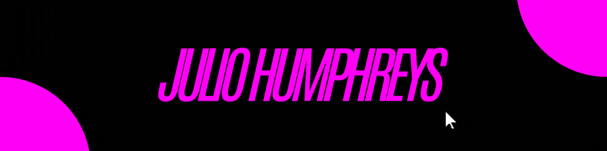

    

##

 Estudante de Sistemas de Informação na Faculdade Impacta Tecnologia. Estou sempre em busca de novas oportunidades para ampliar meus conhecimentos e enfrentar desafios na área de tecnologia. Sou movido pela curiosidade e pela vontade de aprender para a criação de soluções inovadoras.

##

<h3 align="left">Connect with me!</h3>

 

<h3 align="left">My Stack ~</h3>

  
  
  
  

##

    <h3>* GitHub Stats *</h3>
     
    
    

##

<picture align="center">
  <source media="(prefers-color-scheme: dark)" srcset="https://raw.githubusercontent.com/humphreysjulio/humphreysjulio/output/github-contribution-grid-snake-dark.svg">
  <source media="(prefers-color-scheme: light)" srcset="https://raw.githubusercontent.com/humphreysjulio/humphreysjulio/output/github-contribution-grid-snake-dark.svg">
  
</picture>
