

  

 

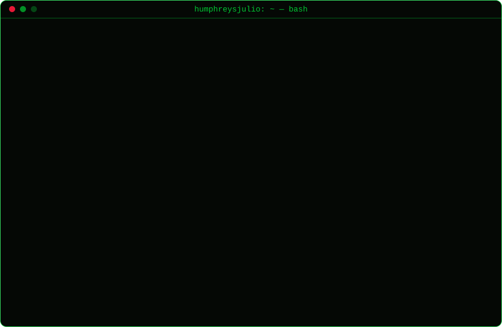

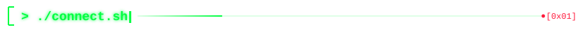 ./connect.sh">

<a href="https://www.instagram.com/humphreysjulio">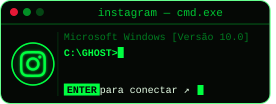</a><a href="https://www.linkedin.com/in/humphreysjulio">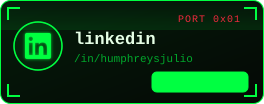</a><a href="mailto:juliochreis@gmail.com">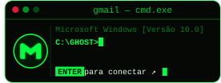</a>

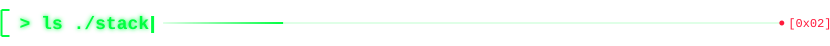 ls ./stack">

  
<picture>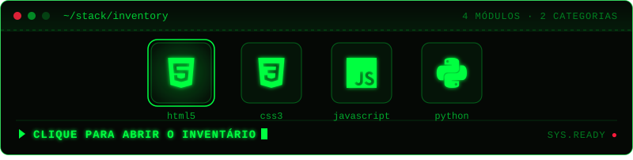</picture>

   

  

    
<picture></picture>

    <dl><dd>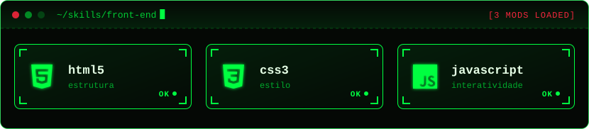</dd></dl>
  

  

    
<picture></picture>

    <dl><dd>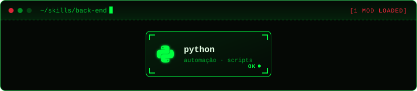</dd></dl>
  

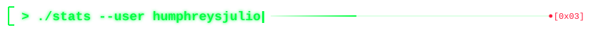 ./stats --user humphreysjulio">

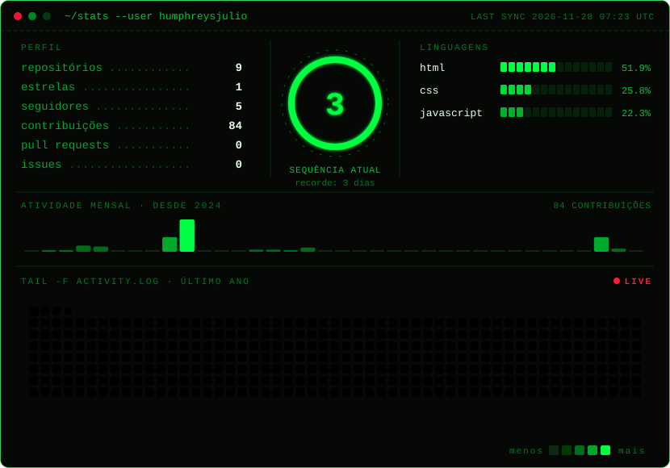

 

  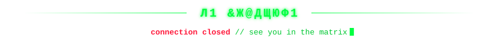
   
  

